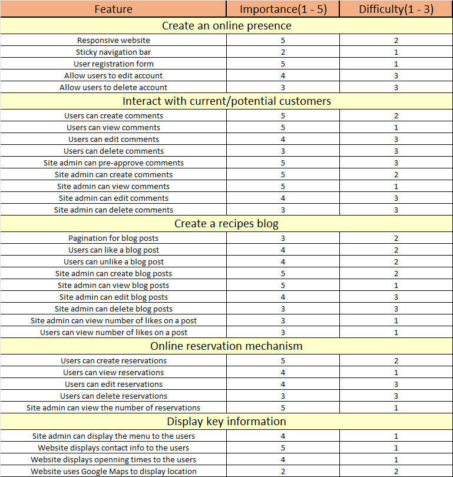
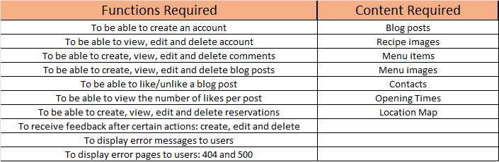
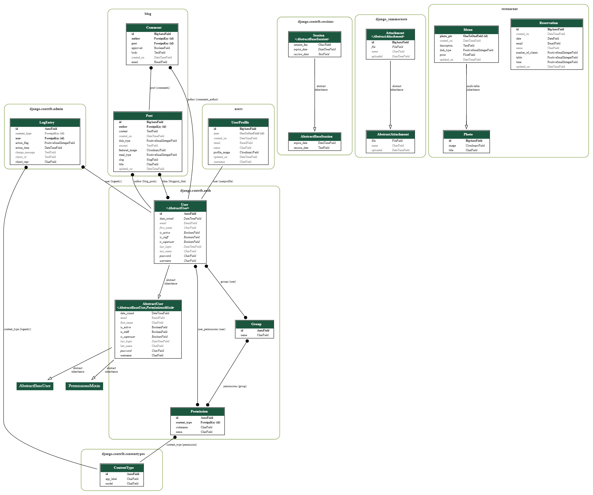

# **MP4 - A Taste of Lisbon**

## **Introduction** 

A Taste of Lisbon -  an online blog/restaurant - was created for educational purposes only as the 4th project in the Code Institute’s full stack development program.

Using the principles of UX design and the agile development methodology, this project was developed using HTML, CSS, JavaScript, Python and the Django framework. 

[View live project here](https://a-taste-of-lisbon.herokuapp.com/)

## **Table of content** 

  - [UX Design](#ux-design)
    - [Strategy](#strategy)
    - [User stories](#user-stories)
    - [Scope](#scope)
    - [Structure](#structure)
    - [Skeleton](#skeleton)
    - [Surface](#surface)
  - [Features](#features)
    - [Implemented features](#implemented-features)
    - [Features left to implement](#features-left-to-implement)
  - [Technologies Used](#technology-used)
    - [Languages](#languages)
    - [Database](#database)
    - [Libraries, frameworks and other technologies](#libraries-frameworks-and-other-technologies)
  - [Code organisation](#code-organisation)
  - [Data validation](#data-validation)
  - [Testing](#testing)
  - [Deployment](#deployment)
    - [Deploying this project](#deploying-this-project)
    - [Using this project locally](#using-this-project-locally)
   - [Credits](#credits)
     - [Code](#code)
     - [Content](#content)
     - [Media](#media)
     - [Acknowledgment](#acknowledgments)

# **UX DESIGN**

- ## **Strategy**

  A Taste of Lisbon is a small restaurant that lacks an online presence and would like to increase the engagement with its customers and potential customers through an online platform. As such they have identified the following areas of opportunity:

    - Create an online presence
    - Interact with current/potential customers
    - Create a recipes blog
    - Creat an online reservation mechanism
    - Display key information

  ### Site Objectives:

    - Interact with the users
    - Display key information to the users
    - Attract more customers

  ### User Needs:

    - Quick and intuitive navigation
    - Easy access to key information
    - Quick and hassle-free processes(register, reservation, etc...)

- ## **User stories**

  ### Site user:

    - As a site user I can register an account so that I can comment and like posts
    - As a site user I can view the menu so that I can determine if I want to eat at this restaurant
    - As a site user I can view key information so that I know when the restaurant is open, or where it is located
    - As a site user I can view a paginated list of posts so that I can easily select a post to view
    - As a site user I can make, edit and delete comments so that I have control over how I interact with the blog community
    - As a site user I can like a post so that the author knows I enjoyed the content
    - As a site user I can make, edit, view and delete my reservations so that I can have control over when I will eat at the restaurant
    - As a site user I can remove a like so that I can demonstrate that I am no longer interested in/agree with the post
    - As a site user I can edit my account so that I can update any information as it changes
    - As a site user I can delete my account so that I can choose to no longer be a member of the site community

  ### Site admin:

    - As a site admin I can create, edit, view and delete posts so that I can be in total control of my sites content
    - As a site admin I can approve comments so that I can filter out any unwanted comments
    - As a site admin I can make, edit and remove comments so that I have total control over my interactions with the site community
    - As a site admin I can view member accounts so that I know how many users have registered
    - As a site admin I can view the number of reservations so that I can advise the kitchen of how customers are expected
    - As a site admin I can display key information so that users know where the restaurant is located and what's on the menu

  ### Common stories:

    - As a site user|admin I can view the comments so that I can be aware of the conversation
    - As a site user|admin I can view likes so that I am aware of which topics are trendy

- ## **Scope**

  - ### Features
    

    This website will released as a minimal viable product with the above features implemented in this release. 
    There will be room for improvement and new features may be added in future releases.

  - ### Functionality and Content
    

    The above functionality and content have been identified as mandatory for this release.

- ## **Structure**

  - ### Information Architecture
  

  The navigation for this website was designed to be user-friendly and intuitive. Grouping pages according to relationships and functionality. As can be seen in the mapping image, the user never has to traverse more than 3 layers deep from the home page.

  - ### Entity Relationship Model
  

  The ERM design demonstrates how the information will be stored while the data is at rest. Here we can see one-to-many relationships between the User model and the Comment and/or Post model. The same relationship is established between the Post model and the Comment. The Reservation model does not establish any direct relationship, this allows for greater flexibility and doesn't limit the reservation functionality to only Users that are already in the database. The Menu model inherits from the Photo model, the rest of the relationships are derived from Django built-in models such as User, AbstractUser, Session, etc...

- ## **Skeleton**

  - ### Wireframes

    - The full wireframes documentation can be found here [wireframes](./wireframes.md). The wireframes were used as a guide for the layouts of the various pages. However, the final project does not always represent an exact replica of the wireframe. This can be attributed to various reasons, such as the final design is more visually appealing, lack of knowledge on my part, better alternative layout discovered, etc..

- ## **Surface**

  - ### Colors

  - ### Typography

  - ### Icons

  - ### Images

# **FEATURES**

- ## **Implemented features**

- ## **Features left to implement**

# **TECHNOLOGY USED**

- ## **Languages**

- ## **Database**

- ## **Libraries frameworks and other technologies**

# **CODE ORGANISATION**

# **DATA VALIDATION**

# **TESTING**

# **DEPLOYMENT**

- ## **Deploying this project**

- ## **Using this project locally**

# **CREDITS**

- ## **Code**

- ## **Content**

- ## **Media**

- ## **Acknowledgments**