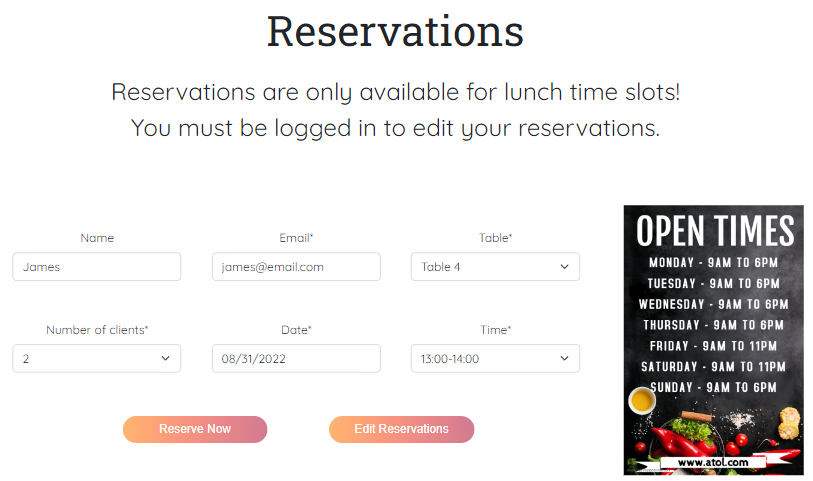

# **MP4 - A Taste of Lisbon**

## **Introduction** 


A Taste of Lisbon - an online blog/restaurant - was created for educational purposes only as the 4th project in the Code Institute’s full stack development program.

Using the principles of UX design and the agile development methodology, this project was developed using HTML, CSS, JavaScript, Python and the Django framework. 

[View live project here](https://a-taste-of-lisbon.herokuapp.com/)

## **Table of content** 

  - [UX Design](#ux-design)
    - [Strategy](#strategy)
    - [User stories](#user-stories)
    - [Scope](#scope)
    - [Structure](#structure)
    - [Skeleton](#skeleton)
    - [Surface](#surface)
  - [Features](#features)
    - [Implemented features](#implemented-features)
    - [Features left to implement](#features-left-to-implement)
  - [Technologies Used](#technology-used)
    - [Languages](#languages)
    - [Database](#database)
    - [Libraries, frameworks and other technologies](#libraries-frameworks-and-other-technologies)
  - [Code structure](#code-structure)
  - [Data validation](#data-validation)
  - [Testing](#testing)
  - [Deployment](#deployment)
    - [Deploying this project](#deploying-this-project)
    - [Using this project locally](#using-this-project-locally)
   - [Credits](#credits)
     - [Code](#code)
     - [Content](#content)
     - [Media](#media)
     - [Acknowledgment](#acknowledgments)

# **UX DESIGN**

- ## **Strategy**

  A Taste of Lisbon is a small restaurant that lacks an online presence and would like to increase the engagement with its customers and potential customers through an online platform. As such they have identified the following areas of opportunity:

    - Create an online presence
    - Interact with current/potential customers
    - Create a recipes blog
    - Create an online reservation mechanism
    - Display key information

  ### Site Objectives:

    - Interact with the users
    - Display key information to the users
    - Attract more customers

  ### User Needs:

    - Quick and intuitive navigation
    - Easy access to key information
    - Quick and hassle-free processes(register, reservation, etc...)

- ## **User stories**

  ### Site user:

    - As a site user I can register an account so that I can comment and like posts
    - As a site user I can view the menu so that I can determine if I want to eat at this restaurant
    - As a site user I can view key information so that I know when the restaurant is open, or where it is located
    - As a site user I can view a paginated list of posts so that I can easily select a post to view
    - As a site user I can make, edit and delete comments so that I have control over how I interact with the blog community
    - As a site user I can like a post so that the author knows I enjoyed the content
    - As a site user I can make, edit, view and delete my reservations so that I can have control over when I will eat at the restaurant
    - As a site user I can remove a like so that I can demonstrate that I am no longer interested in/agree with the post
    - As a site user I can edit my account so that I can update any information as it changes
    - As a site user I can delete my account so that I can choose to no longer be a member of the site community

  ### Site admin:

    - As a site admin I can create, edit, view and delete posts so that I can be in total control of my sites content
    - As a site admin I can approve comments so that I can filter out any unwanted comments
    - As a site admin I can make, edit and remove comments so that I have total control over my interactions with the site community
    - As a site admin I can view member accounts so that I know how many users have registered
    - As a site admin I can view the number of reservations so that I can advise the kitchen of how customers are expected
    - As a site admin I can display key information so that users know where the restaurant is located and what's on the menu

  ### Common stories:

    - As a site user|admin I can view the comments so that I can be aware of the conversation
    - As a site user|admin I can view likes so that I am aware of which topics are trendy

- ## **Scope**

  - ### Features
    

    This website will released as a minimal viable product with the above features implemented in this release. 
    There will be room for improvement and new features may be added in future releases.

  - ### Functionality and Content
    

    The above functionality and content have been identified as mandatory for this release.

- ## **Structure**

  - ### Information Architecture
  

  The navigation for this website was designed to be user-friendly and intuitive. Grouping pages according to relationships and functionality. As can be seen in the mapping image, the user never has to traverse more than 3 layers deep from the home page.

  - ### Entity Relationship Model
  

  The ERM design demonstrates how the information will be stored while the data is at rest. Here we can see one-to-many relationships between the User model and the Comment and/or Post model. The same relationship is established between the Post model and the Comment. The Reservation model does not establish any direct relationship, this allows for greater flexibility and doesn't limit the reservation functionality to only Users that are already in the database. The Menu model inherits from the Photo model, the rest of the relationships are derived from Django built-in models such as User, AbstractUser, Session, etc...

- ## **Skeleton**

  - ### Wireframes

    - The full wireframes documentation can be found here [wireframes](./wireframes.md). The wireframes were used as a guide for the layouts of the various pages. However, the final project does not always represent an exact replica of the wireframe. This can be attributed to various reasons, such as the final design is more visually appealing, lack of knowledge on my part, better alternative layout discovered, etc..

- ## **Surface**

  - ### Colours

    - The following colour palette were used throughout the project. these were taken from the [mycolor](https://mycolor.space/) website.

      

       

  - ### Typography

    - The fonts chosen for this project were taken from [GoogleFonts](https://fonts.google.com/)

        - font-family: 'Quicksand'

        - font-family: 'Roboto Slab'

        - font-family: 'EB Garamond'

  - ### Icons

    - The various icons utilized throughout the different pages were all taken from [fontawesome](https://fontawesome.com/)

  - ### Images

    - All images except for profile pictures were sourced from [Unsplash](https://unsplash.com/) and [Pexels](https://www.pexels.com/)

    - The profile pictures are randomly generated faces from [ThisPersonDoesNotExist](https://thispersondoesnotexist.com/)

# **FEATURES**

- ## **Implemented features**

  - ### User Registration

    Users can register and create an account. This will create a User instance and trigger a Django signal to 
    automatically create a Profile for this user and link them together. A message will then be displayed to the user so they know the registration was successful.

    

    

  - ### User Login/Logout

    Registered users are able to log in and out at will. However, certain features are only available to users that are logged in given the user and incentive to do so. The user is also constantly given feedback through messages that appear at the top of the page below the navbar, so that they know an action has been carried out or not.

    

    

    

  - ### User Profile

    Each registered user is given a profile they can choose to supply information and an image for. They are also able to edit all visible fields in this profile or delete the profile if they no longer which to be a registered user.

    

  - ### Paginated Menu/Blog

    The menu page lists up to 6 different menu items and then will create a link below to the next page. This will continue until either the last 6 or less items are displayed. For the blog up to 4 articles will be displayed per page and then the same logic will be applied as in the menu page. New pages will be created until the last 4 or less posts remain and are displayed.

    

    

  - ### Blog Recipe Search

    The various blog pages have a search bar which can be used to search for recipes by name. This search functionality will look for recipes that match the user input or that contain those words in their title.

    

  - ### Recipe Categories

    Each blog post(recipe) has been created with certain identifier fields. Such as if it's a meat dish or salad, etc... These categories are then displayed under the search bar. the user can select a category and this will filter the posts by those that belong in the chosen category.

    

  - ### Popular Articles

    The 3 blog posts with the most comments will be displayed in the popular articles section so that the user knows which recipes are trendy or have the greatest amount of interaction between the website's community. The 3 articles will be ordered by descending order so that the post with the most comments appears first.

    

  - ### Tag Cloud/Tags

    Each blog post(recipe) will have two identifying fields, dish type and meal type. These fields will auto generate tags which the user can select to filter all posts with the same tag as the selected one.

    

  - ### Blog Post/Like

    Every post created will have key information displayed to the user. This information includes, who the author of the post is, when it was created and how many likes the post has. If the user is a registered user, they can choose to like or unlike as many posts as they desire.

    

  - ### Blog Comments

    All registered users can choose to leave a comment on any blog post. The comment will then go to an approval queue to be released by a staff member. Once approved the comment will be displayed. Users who create a comment will also have the option to edit or delete their comments.

    

  - ### Reservations

    All visitors, whether they are a register user or not, will have the option to book a reservation. The user can choose a date, a time slot, how many people will be present and a table. However, in order to be able to edit their reservations a user must be registered and logged in.

    

    

  - ### Admin/Staff

    Admin or staff members will be people to access all of their data and perform CRUD actions on the front-end. There is no need to visit the Django admin panel unless they wish to create a new superuser. Staff members will be granted special privileges that regular users do not have access to. Staff members can create, edit or delete blog posts. They can create, edit or delete menu items. A staff profile allows them to approve any pending comments, view the total reservations that have been booked or how many registered users there are and their info.

    

    

    

    

    

    

    

- ## **Features left to implement**

  - ### Modals

    The use of modals to pop up and display forms so that the user does not have to leave the page they are on.

  - ### AJAX

    Process the form post requests using AJAX so that page refreshing is reduced. This will increase the application's speed and improve user experience.

  - ### Google Maps API

    Instead of using a static image of a map, the Google Maps API would allow users the functionalities associated with using a Google map.

  - ### 404 and 500 error pages

    Display 404 error page if user tries to access a page that does not exist. Display 500 error page when the server is having issues or is unavailable.

# **TECHNOLOGY USED**

- ## **Languages**

 - Python, HTML, CSS, JavaScript

- ## **Database**

  - PostgreSQL

- ## **Libraries frameworks and other technologies**

  - Django, jQuery, Bootstrap, Cloudinary, Crispy Forms, Summernote, Pillow, Whitenoise

# **CODE STRUCTURE**

  - ## Project

    The Django project was named taste_of_lisbon. This is where the settings.py file and the main urls.py files are housed. All applications created will inherit the settings defined in the project and all URL paths defined will be linked to the main URL file in the project. 
    The project will also import the os module and link the env.py file to the settings file. This will allow for a separate file that houses environment variables with sensitive information, such as passwords and private URL paths. 
    As the project grew it quickly became evident that more than one app was going to be needed in order to separate functionality and make it easier to address the requirements separately.

  - ## Apps

      - ### Blog

        The blog app houses the functionality for the blog section of the project. This is where staff can perform CRUD operations such as creating a new blog post or editing an existing post. This app also allows for registered users to leave comments on any post and also edit or delete their comments. Finally, the like functionality, which can be used by registered users to like or unlike a post.

      - ### Restaurant

        The restaurant app contains the functionality for the menu and reservations sections. Staff can perform CRUD operations on the menu items, such as add an item to the menu or delete items from the menu. Reservations are also defined in the restaurant app, users and staff can make reservations, view, edit or delete them. Finally, this app houses the home and about sections as this is a restaurant business it made sense to place these here.

      - ### Users

        The users app is where all the code for registering users and building user profiles can be found. User information is defined here, such as what fields should make up a user profile. This is where the functionality is stored for users to be able to edit their profiles, add a profile image, change their password, etc... The login and logout functionalities are also defined here, as well as, certain privileges which are granted to staff members only, restricting non-staff users from accessing this content.

  - ## Static

    The static folder is where the JavaScript and CSS files can be found. There are both linked to the base html template defined in the main project and then re used throughout the app templates through inheritance of the base template.

  - ## Documentation

    This folder contains most of the documentation related to the whole project. The 5 planes of UX design can be found here with their respective supporting images and content. There is also a features folder contained images related to the features that were implemented for this project. Finally, there is a tests folder, which holds all the supporting images for the various tests and validations that were performed.

# **TESTING**

  - A full lists of tests performed as well the results can be found [here](./test_docs.md)

# **DEPLOYMENT**

- ## **Deploying this project**

  Deploying the project using Heroku:

  1. Login to [Heroku](https://dashboard.heroku.com/apps) and Create a New App

  2. Give the App a name, it must be unique, and select a region closest to you

  3. Click on 'Create App', this will take you to a page where you can deploy your project

  4. Click on the 'Resources' tab and search for 'Heroku Postgres' as this is the add-on you will use for the deployed database

  5. Click on the 'Settings' tab at the top of the page. The following step must be completed before deployment. 

  6. Scroll down to 'Config Vars' and click 'Reveal Config Vars'. Here the database URL is stored, it is the connection to the database, so this must be copied and stored within   env.py as a root level file.

  The env.py files is where the projects secret environment variables are stored. This file is then added to a .gitignore file so it isn't stored publicly within the projects   repository.

  7. Next, the secret key needs to be created within the projects env.py file on GitPod and then added to the Config Vars on Heroku. Once added, go to the settings.py file on  GitPod.

  8. Within the [settings.py](./taste_of_lisbon/settings.py) file you need to import several libraries:
      ```python
      import os
      import dj_database_url
      from django.contrib.messages import constants as messages
      if os.path.isfile('env.py'):
          import env
      ```

  9. Then, we need to replace the current insecure secret key with ```os.environ.get('SECRET_KEY)'```, that we set within the env.py file.

  10. Once the secret key is replaced, scroll down to DATABASES to connect to the Postgres database. Comment out the current code and add the following python dictionary: 
  ```python
  DATABASES = { 'default': dj_database_url.parse(os.environ.get('DATABASE_URL')) }
  ```

  11. The next step is to connect the project to whitenoise, which is where the static files will be stored. You can find a full explanation of how to install whitenoise [here](http://whitenoise.evans.io/en/stable/)

  12. Then on Heroku add to the Config Vars, DISABLE_COLLECTSTATIC = 1, as a temporary measure to enable deployment without any static files, this will be removed when it is time  to deploy the full project.

  13. Next we need to tell Django where to store the media and static files. Towards the bottom of settings.py file we can add:

  ```python
  STATIC_URL = '/static/'
  STATICFILES_DIRS = [os.path.join(BASE_DIR, 'static')]
  STATIC_ROOT = os.path.join(BASE_DIR, 'staticfiles')
  MEDIA_URL = '/media/'
  ```

  14. Then we need to tell Django where the templates will be stored. At the top of settings.py, under BASE_DIR (the base directory), add a templates directory and then scroll   down to TEMPLATES and add the templates directory variable to 'DIRS': [].

  15. Now we have to add our Heroku Host Name into allowed hosts in settings.py file:

  ```python
  ALLOWED_HOSTS = ['YOUR-APP-NAME-HERE', 'localhost']
  ```

  16. Finally, to complete the first deployment set up of the skeleton app, create a Procfile so that Heroku knows how to run the project. Within this file add the following:  web: gunicorn APP-NAME.wsgi Web tells Heroku to allow web traffic, whilst gunicorn is the server installed earlier, a web services gateway interface server (wsgi). This is a  standard that allows Python services to integrate with web servers.

  17. Now, go to the 'Deploy' Tab on Heroku. Find the 'Deployment Method' section and choose GitHub. Connect to your GitHub account and find the repo you want to deploy. 

  18. Scroll down to the Automatic and Manual Deploys sections. Click 'Deploy Branch' in the Manual Deploy section and waited as Heroku installed all dependencies and deployed   the code.

  21. Once the project is finished deploying, click 'Open App' to see the newly deployed project.

  22. Before deploying the final draft of your project you must:

  - Remove staticcollect=1 from congifvars within Heroku
  - Ensure DEBUG is set to false in settings.py file or:

- ## **Using this project locally**

  1. Log in to GitHub and locate the [GitHub Repository](https://github.com/DioCar84/A-Taste-of-Lisbon)
  2. Under the repository name, click "Clone or download".
  3. To clone the repository using HTTPS, under "Clone with HTTPS", copy the link.
  4. Open Git Bash
  5. Change the current working directory to the location where you want the cloned directory to be made.
  6. Type `git clone`, and then paste the URL you copied in Step 3.
  
      $ `https://github.com/DioCar84/A-Taste-of-Lisbon.git`
  
  7. Press Enter. Your local clone will be created.
 
  Alternatively, if using Gitpod, you can click below to create your own workspace using this repository.
  
  [](https://gitpod.io/#https://github.com/DioCar84/A-Taste-of-Lisbon)

  You will need to also install all required packages in order to run this application on Heroku, refer to [requirements.txt](./requirements.txt)
  * Command to install this apps requirements is `pip3 install -r requirements.txt`

# **CREDITS**

- ## **Code**

  - As always a big thanks to everyone who answers questions on [stackoverflow](https://stackoverflow.com/). Whenever I was stumped or did not know how to implement a certain functionality there was a post on stack overflow which gave me the answer and could be adapted to my project's needs.

  - The blog search functionality as well as the User profile come from the [Python Django - Complete Course on](https://www.udemy.com/course/python-django-2021-complete-course/) which is available on the online learning platform [Udemy](https://www.udemy.com/).

  - The calendar widget was taken from [FengyuanChen](https://github.com/fengyuanchen/datepicker)

  - The Post and Comment models were taken from the [Code Institutes](https://codeinstitute.net/) Django lessons, more specifically the I Think Before I Blog section

  - The blog page as well as each blog post where adapted from the [Andrea Blog Template](https://themewagon.com/themes/free-bootstrap-4-html5-blog-website-template-andrea/) and [Reporter](https://themefisher.com/products/reporter)

  - The footer social media buttons can be found at [mdbootstrap](https://mdbootstrap.com/docs/standard/navigation/footer/)

  - most buttons displayed across the various webpages will be an adaptation of button 21 from [CSS Scan](https://getcssscan.com/css-buttons-examples)

  - this read me file and supporting docs were adapted from 2 former Code Institute student's projects [Codzilla](https://github.com/lemocla/Codzilla) and [Cryptics](https://github.com/RiyadhKh4n/cryptics) 

- ## **Content**

  For the most part the content displayed is original, however the blog recipes were taken from various sources:

    - [Allrecipes](https://www.allrecipes.com/recipes/724/world-cuisine/european/portuguese/)

    - [Home Made Interest](https://www.homemadeinterest.com/)

    - [Food From Portugal](https://www.foodfromportugal.com/)

- ## **Media**

  - All images except for profile pictures were sourced from [Unsplash](https://unsplash.com/) and [Pexels](https://www.pexels.com/)

  - The profile pictures are randomly generated faces from [ThisPersonDoesNotExist](https://thispersondoesnotexist.com/)

- ## **Acknowledgments**

  - First and foremost I would like to thank my family for putting up with me while I would get lost for hours on end tinkering and labouring on this project

  - A big thank you also has to go out to the Code Institute slack community, so very friendly and patient and willing to help out

  - My mentor Dario for the sound advice and support

  - Last but not least the Stack Overflow community, seriously what would we do without Stack Overflow...


