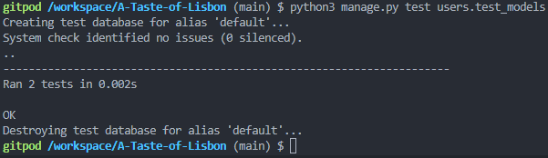
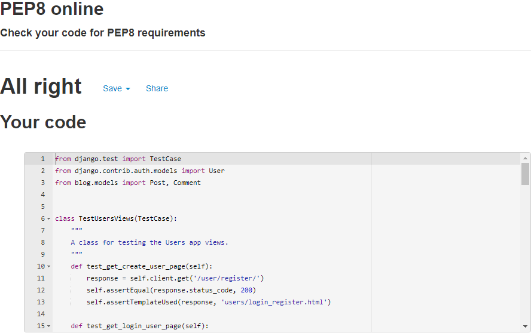
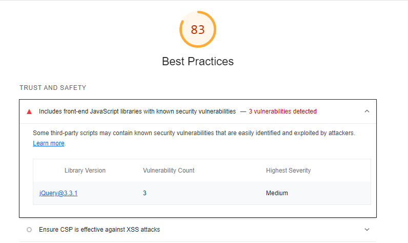

# Testing

## Django Testing (Unit Tests)

For testing Django functionality I used the built in Django TestCase class.

### A Taste of Lisbon Project:

#### Restaurant App:

##### Forms

- Tests developed for the Menu Form:

```python
class TestMenuForm(TestCase):
    """
    A class for testing the Menu form.
    """

    def test_form_data_input_is_valid(self):
        form = MenuForm(data={
            'title': 'Roast Lamb',
            'description': 'Roast Lamb',
            'dish_type': 2,
            'price': 12.99,
        })

        self.assertTrue(form.is_valid())

    def test_fields_user_has_access_to(self):
        form = MenuForm()
        self.assertEqual(
            form.Meta.fields,
            '__all__'
        )

    def test_title_field_cannot_be_empty(self):
        form = MenuForm({'title': ''})
        self.assertFalse(form.is_valid())
        self.assertIn('title', form.errors.keys())
        self.assertEqual(form.errors['title'][0], 'This field is required.')

    def test_price_field_cannot_be_empty(self):
        form = MenuForm({'price': ''})
        self.assertFalse(form.is_valid())
        self.assertIn('price', form.errors.keys())
        self.assertEqual(form.errors['price'][0], 'This field is required.')

    def test_description_field_cannot_be_empty(self):
        form = MenuForm({'description': ''})
        self.assertFalse(form.is_valid())
        self.assertIn('description', form.errors.keys())
        self.assertEqual(
            form.errors['description'][0],
            'This field is required.'
        )

    def test_dish_type_field_cannot_be_empty(self):
        form = MenuForm({'dish_type': ''})
        self.assertFalse(form.is_valid())
        self.assertIn('dish_type', form.errors.keys())
        self.assertEqual(
            form.errors['dish_type'][0],
            'This field is required.'
        )
```

- Tests results:

_results.png)

- Tests developed for the Reservation Form:

```python
class TestReservationForm(TestCase):
    """
    A class for testing the Reservation form.
    """

    def test_form_data_input_is_valid(self):
        form = ReservationForm(data={
            'email': 'john@email.com',
            'table': 6,
            'number_of_clients': 4,
            'date': '08/22/2022',
            'time': 3,
        })

        self.assertTrue(form.is_valid())

    def test_fields_user_has_access_to(self):
        form = ReservationForm()
        self.assertEqual(
            form.Meta.fields,
            [
                'name',
                'email',
                'table',
                'number_of_clients',
                'date',
                'time'
            ]
        )

    def test_email_field_cannot_be_empty(self):
        form = ReservationForm({'email': ''})
        self.assertFalse(form.is_valid())
        self.assertIn('email', form.errors.keys())
        self.assertEqual(form.errors['email'][0], 'This field is required.')

    def test_table_field_cannot_be_empty(self):
        form = ReservationForm({'table': ''})
        self.assertFalse(form.is_valid())
        self.assertIn('table', form.errors.keys())
        self.assertEqual(form.errors['table'][0], 'This field is required.')

    def test_number_of_clients_field_cannot_be_empty(self):
        form = ReservationForm({'number_of_clients': ''})
        self.assertFalse(form.is_valid())
        self.assertIn('number_of_clients', form.errors.keys())
        self.assertEqual(
            form.errors['number_of_clients'][0],
            'This field is required.'
        )

    def test_date_field_cannot_be_empty(self):
        form = ReservationForm({'date': ''})
        self.assertFalse(form.is_valid())
        self.assertIn('date', form.errors.keys())
        self.assertEqual(form.errors['date'][0], 'This field is required.')

    def test_time_field_cannot_be_empty(self):
        form = ReservationForm({'time': ''})
        self.assertFalse(form.is_valid())
        self.assertIn('time', form.errors.keys())
        self.assertEqual(form.errors['time'][0], 'This field is required.')
```

- Tests results:

_results.png)

##### Models

- Tests developed for the Restaurant app models:

```python
class TestRestaurantModels(TestCase):
    '''
    A class to test models in the Restaurant app.
    '''
    def test_reservation_item_created_now(self):
        item = Reservation.objects.create(
            email='john@email.com',
            table=6,
            number_of_clients=4,
            date='2022-08-22',
            time=3,
        )
        current_date = date.datetime.now()
        self.assertEqual(current_date.date(), item.created_on.date())

    def test_default_image_name(self):
        item = Photo.objects.create(
            title='random photo'
        )

        self.assertEqual(item.image, 'yleipz1gqfmdwpnbtx0v.jpg')

    def test_menu_item_created_now(self):
        item = Menu.objects.create(
            title='Roast Lamb',
            description='Roast Lamb',
            dish_type=2,
            price=12.99,
        )
        current_date = date.datetime.now()
        self.assertEqual(current_date.date(), item.created_on.date())

```

- Tests results:


##### Views

- Tests developed for the Restaurant app views:

```python
class TestRestaurantViews(TestCase):
    """
    A class for testing the Restaurant app views.
    """
    def test_get_home_page(self):
        hero_image = Photo.objects.create(title='Lisbon Tram')
        response = self.client.get('/')
        self.assertEqual(response.status_code, 200)
        self.assertTemplateUsed(response, 'restaurant/home.html')

    def test_get_menu_page(self):
        response = self.client.get('/menu/')
        self.assertEqual(response.status_code, 200)
        self.assertTemplateUsed(response, 'restaurant/menu.html')

    def test_get_create_menu_item_page(self):
        item = Menu.objects.create(
            title='Roast Lamb',
            description='Roast Lamb',
            dish_type=2,
            price=12.99,
        )
        response = self.client.get('/create_menu/')
        self.assertEqual(response.status_code, 200)
        self.assertTemplateUsed(response, 'restaurant/menu_form.html')

    def test_get_edit_menu_item_page(self):
        item = Menu.objects.create(
            title='Roast Lamb',
            description='Roast Lamb',
            dish_type=2,
            price=12.99,
        )
        response = self.client.get(f'/edit_menu/{item.id}/')
        self.assertEqual(response.status_code, 200)
        self.assertTemplateUsed(response, 'restaurant/menu_form.html')

    def test_get_delete_menu_item_page(self):
        item = Menu.objects.create(
            title='Roast Lamb',
            description='Roast Lamb',
            dish_type=2,
            price=12.99,
        )
        response = self.client.get(f'/delete_menu/{item.id}/')
        self.assertEqual(response.status_code, 200)
        self.assertTemplateUsed(response, 'restaurant/delete_item.html')

    def test_get_reservations_page(self):
        open_image = Photo.objects.create(title='Open Times')
        open_banner = Photo.objects.create(title='Open Times Banner')
        response = self.client.get('/reservations/')
        self.assertEqual(response.status_code, 200)
        self.assertTemplateUsed(response, 'restaurant/reservations.html')

    def test_get_redirected_by_user_reservations_page(self):
        response = self.client.get('/reservations/user/')
        self.assertEqual(response.status_code, 302)
        self.assertRedirects(response, '/user/login/?next=/reservations/user/')

    def test_get_redirected_by_edit_user_reservations_page(self):
        item = Reservation.objects.create(
            email='john@email.com',
            table=6,
            number_of_clients=4,
            date='2022-08-22',
            time=3,
        )
        response = self.client.get(f'/reservations/user/{item.id}')
        self.assertEqual(response.status_code, 302)
        self.assertRedirects(
            response,
            f'/user/login/?next=/reservations/user/{item.id}'
        )

    def test_get_redirected_by_delete_user_reservations_page(self):
        item = Reservation.objects.create(
            email='john@email.com',
            table=6,
            number_of_clients=4,
            date='2022-08-22',
            time=3,
        )
        response = self.client.get(f'/reservations/user/{item.id}/delete')
        self.assertEqual(response.status_code, 302)
        self.assertRedirects(
            response,
            f'/user/login/?next=/reservations/user/{item.id}/delete'
        )

    def test_get_about_page(self):
        map_image = Photo.objects.create(title='Map of London')
        response = self.client.get('/about/')
        self.assertEqual(response.status_code, 200)
        self.assertTemplateUsed(response, 'restaurant/about.html')
```

- Tests results:


#### Blog App:

##### Forms

- Tests developed for the Post Form:

```python
class TestPostForm(TestCase):
    """
    A class for testing the Post form.
    """

    def test_form_data_input_is_valid(self):
        form = PostForm(data={
            'title': 'Lisbon Steak',
            'featured_image': '',
            'excerpt': 'A Lisbon Beef Steak',
            'meal_type': 2,
            'dish_type': 4,
            'content': 'Some random content about this dish'
        })

        self.assertTrue(form.is_valid())

    def test_fields_user_has_access_to(self):
        form = PostForm()
        self.assertEqual(
            form.Meta.fields,
            (
                'title',
                'featured_image',
                'excerpt',
                'meal_type',
                'dish_type',
                'content'
            )
        )

    def test_title_field_cannot_be_empty(self):
        form = PostForm({'title': ''})
        self.assertFalse(form.is_valid())
        self.assertIn('title', form.errors.keys())
        self.assertEqual(form.errors['title'][0], 'This field is required.')

    def test_content_field_cannot_be_empty(self):
        form = PostForm({'content': ''})
        self.assertFalse(form.is_valid())
        self.assertIn('content', form.errors.keys())
        self.assertEqual(form.errors['content'][0], 'This field is required.')

    def test_meal_type_field_cannot_be_empty(self):
        form = PostForm({'meal_type': ''})
        self.assertFalse(form.is_valid())
        self.assertIn('meal_type', form.errors.keys())
        self.assertEqual(
            form.errors['meal_type'][0],
            'This field is required.'
        )

    def test_dish_type_field_cannot_be_empty(self):
        form = PostForm({'dish_type': ''})
        self.assertFalse(form.is_valid())
        self.assertIn('dish_type', form.errors.keys())
        self.assertEqual(
            form.errors['dish_type'][0],
            'This field is required.'
        )
```

- Tests results:

_results.png)

- Tests developed for the Comment Form:

```python
class TestCommentForm(TestCase):
    """
    A class for testing the Comment form.
    """

    def test_form_data_input_is_valid(self):
        form = CommentForm(data={
            'email': 'john@email.com',
            'body': 'some random comment',
        })

        self.assertTrue(form.is_valid())

    def test_fields_user_has_access_to(self):
        form = CommentForm()
        self.assertEqual(
            form.Meta.fields,
            ('body', )
        )

    def test_body_field_cannot_be_empty(self):
        form = CommentForm({'body': ''})
        self.assertFalse(form.is_valid())
        self.assertIn('body', form.errors.keys())
        self.assertEqual(form.errors['body'][0], 'This field is required.')
```

- Tests results:

_results.png)

##### Models

- Tests developed for the Blog app models:

```python
class TestBlogModels(TestCase):
    '''
    A class to test models in the Blog app.
    '''
    def test_post_item_created_now(self):
        item = Post.objects.create(
            title='Lisbon Steak',
            author=User.objects.create(),
            excerpt='A Lisbon Beef Steak',
            meal_type=2,
            dish_type=4,
            content='Some random content about this dish'
        )
        current_date = date.datetime.now()
        self.assertEqual(current_date.date(), item.created_on.date())

    def test_default_featured_image_name(self):
        item = Post.objects.create(
            title='Lisbon Steak',
            author=User.objects.create(),
            excerpt='A Lisbon Beef Steak',
            meal_type=2,
            dish_type=4,
            content='Some random content about this dish'
        )

        self.assertEqual(item.featured_image, 'placeholder')

    def test_post_title_must_be_unique(self):
        item = Post.objects.create(
            title='Lisbon Steak',
            author=User.objects.create(),
            excerpt='A Lisbon Beef Steak',
            meal_type=2,
            dish_type=4,
            content='Some random content about this dish'
        )

        password = 'mypassword'
        my_admin = User.objects.create_superuser(
            'myuser',
            'myemail@test.com',
            password
        )

        form = PostForm(data={
            'title': 'Lisbon Steak',
            'author': my_admin.username,
            'excerpt': 'A Lisbon Beef Steak',
            'meal_type': 2,
            'dish_type': 4,
            'content': 'Some random content about this dish'
        })

        self.assertFalse(form.is_valid())
        self.assertIn('title', form.errors.keys())
        self.assertEqual(
            form.errors['title'][0],
            'Post with this Title already exists.'
        )

    def test_comment_item_created_now(self):
        post = Post.objects.create(
            title='Lisbon Steak',
            author=User.objects.create(),
            excerpt='A Lisbon Beef Steak',
            meal_type=2,
            dish_type=4,
            content='Some random content about this dish'
        )
        item = Comment.objects.create(
            email='john@email.com',
            author=post.author,
            post=post,
            body='some random comment',
        )
        current_date = date.datetime.now()
        self.assertEqual(current_date.date(), item.created_on.date())
```

- Tests results:

_results.png)

##### Views

- Tests developed for the Blog app views:

```python
class TestBlogViews(TestCase):
    """
    A class for testing the Blog app views.
    """
    def test_get_blog_page(self):
        response = self.client.get('/blog/')
        self.assertEqual(response.status_code, 200)
        self.assertTemplateUsed(response, 'blog/blog_home.html')

    def test_get_blog_post_page(self):
        item = Post.objects.create(
            title='Lisbon Steak',
            author=User.objects.create(),
            featured_image='',
            excerpt='A Lisbon Beef Steak',
            meal_type=2,
            dish_type=4,
            content='Some random content about this dish'
        )
        response = self.client.get(f'/blog/{item.id}/')
        self.assertEqual(response.status_code, 200)
        self.assertTemplateUsed(response, 'blog/blog_post.html')

    def test_get_edit_blog_post_page(self):
        item = Post.objects.create(
            title='Lisbon Steak',
            author=User.objects.create(),
            featured_image='',
            excerpt='A Lisbon Beef Steak',
            meal_type=2,
            dish_type=4,
            content='Some random content about this dish'
        )
        response = self.client.get(f'/blog/edit_post/{item.id}/')
        self.assertEqual(response.status_code, 200)
        self.assertTemplateUsed(response, 'blog/edit_post.html')

    def test_get_delete_blog_post_page(self):
        item = Post.objects.create(
            title='Lisbon Steak',
            author=User.objects.create(),
            featured_image='',
            excerpt='A Lisbon Beef Steak',
            meal_type=2,
            dish_type=4,
            content='Some random content about this dish'
        )
        response = self.client.get(f'/blog/delete_post/{item.id}/')
        self.assertEqual(response.status_code, 200)
        self.assertTemplateUsed(response, 'blog/delete_post.html')

    def test_get_edit_blog_comment_page(self):
        post = Post.objects.create(
            title='Lisbon Steak',
            author=User.objects.create(),
            featured_image='',
            excerpt='A Lisbon Beef Steak',
            meal_type=2,
            dish_type=4,
            content='Some random content about this dish'
        )
        item = Comment.objects.create(
            email='john@email.com',
            author=post.author,
            post=post,
            body='some random comment',
        )
        response = self.client.get(f'/blog/edit_comment/{item.id}/')
        self.assertEqual(response.status_code, 200)
        self.assertTemplateUsed(response, 'blog/edit_comment.html')

    def test_get_delete_blog_comment_page(self):
        post = Post.objects.create(
            title='Lisbon Steak',
            author=User.objects.create(),
            featured_image='',
            excerpt='A Lisbon Beef Steak',
            meal_type=2,
            dish_type=4,
            content='Some random content about this dish'
        )
        item = Comment.objects.create(
            email='john@email.com',
            author=post.author,
            post=post,
            body='some random comment',
        )
        response = self.client.get(f'/blog/delete_comment/{item.id}/')
        self.assertEqual(response.status_code, 200)
        self.assertTemplateUsed(response, 'blog/delete_comment.html')

    def test_get_blog_meal_tag_page(self):
        item = Post.objects.create(
            title='Lisbon Steak',
            author=User.objects.create(),
            featured_image='',
            excerpt='A Lisbon Beef Steak',
            meal_type=2,
            dish_type=4,
            content='Some random content about this dish'
        )
        response = self.client.get(f'/blog/meal_tag/{item.meal_type}/')
        self.assertEqual(response.status_code, 200)
        self.assertTemplateUsed(response, 'blog/blog_home.html')

    def test_get_blog_dish_tag_page(self):
        item = Post.objects.create(
            title='Lisbon Steak',
            author=User.objects.create(),
            featured_image='',
            excerpt='A Lisbon Beef Steak',
            meal_type=2,
            dish_type=4,
            content='Some random content about this dish'
        )
        response = self.client.get(f'/blog/meal_tag/{item.dish_type}/')
        self.assertEqual(response.status_code, 200)
        self.assertTemplateUsed(response, 'blog/blog_home.html')
```

- Tests results:


#### Users App:

##### Forms

- Tests developed for the User Profile Form:

```python
class TestUserProfileForm(TestCase):
    """
    A class for testing the user profile form.
    """

    def test_form_data_input_is_valid(self):
        form = UserProfileForm(data={
            'name': 'John',
            'username': 'John123',
            'email': 'john@email.com'
        })

        self.assertTrue(form.is_valid())

    def test_fields_user_has_access_to(self):
        form = UserProfileForm()
        self.assertEqual(
            form.Meta.fields,
            ['username', 'name', 'email', 'profile_image']
        )

    def test_user_can_be_blank(self):
        form = UserProfileForm({'user': ''})
        self.assertTrue(form.is_valid())

    def test_username_can_be_blank(self):
        form = UserProfileForm({'username': ''})
        self.assertTrue(form.is_valid())

    def test_email_can_be_blank(self):
        form = UserProfileForm({'email': ''})
        self.assertTrue(form.is_valid())
```

- Tests results:


##### Models

- Tests developed for the Users app models:

```python
class TestUsersModels(TestCase):
    '''
    A class to test models in the Users app.
    '''
    def test_user_profile_created_now(self):
        item = UserProfile.objects.create()
        current_date = date.datetime.now()
        self.assertEqual(current_date.date(), item.created_on.date())

    def test_default_profile_image_name(self):
        item = UserProfile.objects.create()
        self.assertEqual(item.profile_image, 'muoktj5dbjhygxwuu0v3.png')
```

- Tests results:



##### Views

- Tests developed for the Users app views:

```python
class TestUsersViews(TestCase):
    """
    A class for testing the Users app views.
    """
    def test_get_create_user_page(self):
        response = self.client.get('/user/register/')
        self.assertEqual(response.status_code, 200)
        self.assertTemplateUsed(response, 'users/login_register.html')

    def test_get_login_user_page(self):
        response = self.client.get('/user/login/')
        self.assertEqual(response.status_code, 200)
        self.assertTemplateUsed(response, 'users/login_register.html')

    def test_get_redirected_by_logout_user_page(self):
        response = self.client.get('/user/logout/')
        self.assertEqual(response.status_code, 302)
        self.assertRedirects(response, '/user/login/')

    def test_get_redirected_by_user_profile_page(self):
        response = self.client.get('/user/profile/')
        self.assertEqual(response.status_code, 302)
        self.assertRedirects(response, '/user/login/')

    def test_get_redirected_by_edit_profile_page(self):
        response = self.client.get('/user/profile/edit/')
        self.assertEqual(response.status_code, 302)
        self.assertRedirects(response, '/user/login/')

    def test_get_redirected_by_delete_profile_page(self):
        response = self.client.get('/user/profile/delete/')
        self.assertEqual(response.status_code, 302)
        self.assertRedirects(
            response,
            '/user/login/'
        )

    def test_get_redirected_by_change_password_page(self):
        response = self.client.get('/user/profile/password/')
        self.assertEqual(response.status_code, 302)
        self.assertRedirects(
            response,
            '/user/login/'
        )

    def test_get_approve_comments_page(self):
        password = 'mypassword'
        my_admin = User.objects.create_superuser(
            'myuser',
            'myemail@test.com',
            password
        )

        self.client.login(username=my_admin.username, password=password)

        response = self.client.get('/user/profile/approve_comments/')
        self.assertEqual(response.status_code, 200)
        self.assertTemplateUsed(response, 'users/approve_comments.html')

    def test_get_delete_comments_page(self):
        password = 'mypassword'
        my_admin = User.objects.create_superuser(
            'myuser',
            'myemail@test.com',
            password
        )

        self.client.login(username=my_admin.username, password=password)

        post = Post.objects.create(
            title='Lisbon Steak',
            author=User.objects.create(),
            featured_image='',
            excerpt='A Lisbon Beef Steak',
            meal_type=2,
            dish_type=4,
            content='Some random content about this dish'
        )
        item = Comment.objects.create(
            email='john@email.com',
            author=post.author,
            post=post,
            body='some random comment',
        )

        response = self.client.get(f'/user/profile/delete_comment/{item.id}')
        self.assertEqual(response.status_code, 200)
        self.assertTemplateUsed(response, 'users/delete_comment.html')

    def test_get_view_users_page(self):
        password = 'mypassword'
        my_admin = User.objects.create_superuser(
            'myuser',
            'myemail@test.com',
            password
        )

        self.client.login(username=my_admin.username, password=password)

        response = self.client.get('/user/profile/view_users')
        self.assertEqual(response.status_code, 200)
        self.assertTemplateUsed(response, 'users/user_accounts.html')
```

- Tests results:


## Validator Testing 
[PEP8 Python Validation](http://pep8online.com/)

### A Taste of Lisbon Project:

##### wsgi.py


##### urls.py


##### settings.py


##### asgi.py


#### Restaurant App:

##### widgets.py


##### views.py


##### urls.py


##### models.py


##### forms.py


##### apps.py


##### admin.py


##### test_forms.py


##### test_models.py


##### test_views.py


#### Blog App:

##### views.py


##### urls.py


##### models.py


##### forms.py


##### apps.py


##### admin.py


##### test_forms.py


##### test_models.py


##### test_views.py


#### Users App:

##### views.py


##### urls.py


##### signals.py


##### models.py


##### forms.py


##### apps.py


##### admin.py


##### test_forms.py


##### test_models.py


##### test_views.py




## [HTML Validation](https://validator.w3.org/)

### Home Page


### Menu Page


### Blog Page


### Blog Post Page


- Errors are related to the Summernote text editor not this project's HTML code

### Reservations Page


### About Page


### Login Page


### Register Page


- Error is related to Django's user creation form not this project's HTML code

### User Profile Page


## [CSS Validation](https://jigsaw.w3.org/css-validator/)


## Lighthouse Score

### Mobile:


### Desktop:


#### Best Practices



- Yellow score due to JQuery library and not the project's code

## User Story Tests

- ### Site user:

    - As a site user I can register an account so that I can comment and like posts

        

    - As a site user I can view the menu so that I can determine if I want to eat at this restaurant

        

    - As a site user I can view key information so that I know when the restaurant is open, or where it is located

        
        

    - As a site user I can view a paginated list of posts so that I can easily select a post to view

        

    - As a site user I can make, edit and delete comments so that I have control over how I interact with the blog community

        

    - As a site user I can like a post so that the author knows I enjoyed the content

        

    - As a site user I can make, edit, view and delete my reservations so that I can have control over when I will eat at the restaurant

        

    - As a site user I can remove a like so that I can demonstrate that I am no longer interested in/agree with the post

        

    - As a site user I can edit my account so that I can update any information as it changes

        

    - As a site user I can delete my account so that I can choose to no longer be a member of the site community

            

- ### Site admin:

    - As a site admin I can create, edit, view and delete posts so that I can be in total control of my sites content

        
        

    - As a site admin I can approve comments so that I can filter out any unwanted comments

        

    - As a site admin I can make, edit and remove comments so that I have total control over my interactions with the site community

        

    - As a site admin I can view member accounts so that I know how many users have registered

        

    - As a site admin I can view the number of reservations so that I can advise the kitchen of how customers are expected

        

    - As a site admin I can display key information so that users know where the restaurant is located and what's on the menu

        
            

- ### Common stories:

    - As a site user|admin I can view the comments so that I can be aware of the conversation

        

    - As a site user|admin I can view likes so that I am aware of which topics are trendy

            

## Manual Testing

Manual testing is the process of manually testing software for defects. It requires a tester to play the role of an end user where by they use most of the application's features to ensure correct behaviour.

- User tries to register with a name already taken:

    

- User tries to create username with invalid characters:

    

- User tries to register with two passwords that don't match:

    

- User tries to register without filling in all the fields:

    

- User tries to login with a username that doesn't exist or is incorrect:

    

- User tries to login without filling in all the fields:

    

- User tries to send a blank reservation form:

    

- User tries to send a blank comment:

    

## Device Display Testing

### Home:

 - #### Mobile:

    

- #### Tablet:

    

- #### Desktop:

    

### Menu:

- #### Mobile:

    

- #### Tablet:

    

- #### Desktop:

    

### Blog:

- #### Mobile:

    

- #### Tablet:

    

- #### Desktop:

    

### Blog Post:

- #### Mobile:

    

- #### Tablet:

    

- #### Desktop:

    

### Reservations:

- #### Mobile:

    

- #### Tablet:

    

- #### Desktop:

    

### About:

- #### Mobile:

    

- #### Tablet:

    

- #### Desktop:

    

### Login:

- #### Mobile:

    

- #### Tablet:

    

- #### Desktop:

    

### Register:

- #### Mobile:

    

- #### Tablet:

    

- #### Desktop:

    

### Profile:

- #### Mobile:

    

- #### Tablet:

    

- #### Desktop:

    

## Browser Compatibility Tests 

A Taste of Lisbon was tested on [Firefox](https://www.mozilla.org/en-GB/firefox/new/), [Google Chrome](https://www.google.com/intl/en_uk/chrome/) and [Brave Browser](https://brave.com/):

- ### Firefox:

    

- ### Google Chrome:

    

- ### Brave Browser:

    
